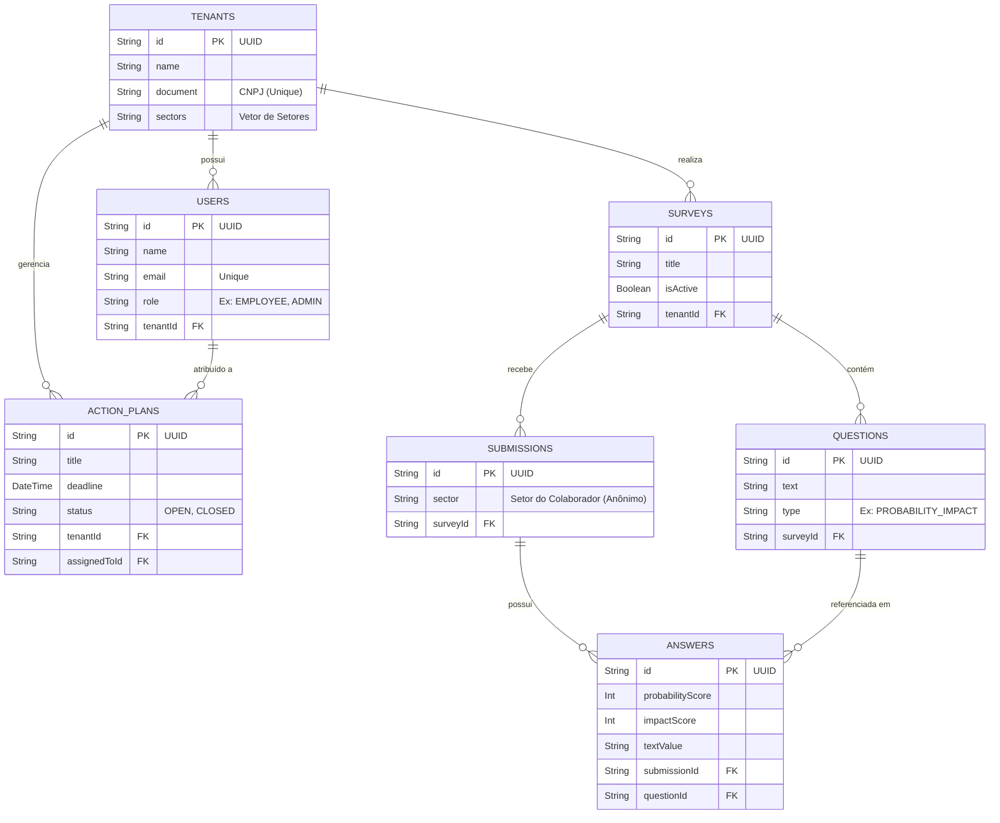

# Documentação do Banco de Dados - Riscos Psicossociais

Este documento detalha a estrutura do banco de dados (PostgreSQL) utilizado pela aplicação de Gestão de Riscos Psicossociais, incluindo seus relacionamentos e dicionário de dados.

## 🗺️ Diagrama Entidade-Relacionamento (ERD)

Abaixo está a representação visual de como as tabelas se conectam no sistema.

---

## 📖 Dicionário de Dados (Tabelas)

### 1. `tenants` (Empresas/Inquilinos)
Representa as empresas clientes que utilizam a plataforma. Toda a arquitetura é multitenant (cada empresa enxerga apenas seus dados).
- **`id`**: Identificador único (UUID).
- **`name`**: Nome da empresa.
- **`document`**: CNPJ ou documento de identificação (único).
- **`sectors`**: Array/String contendo os setores da empresa (ex: RH, TI, Operacional).

### 2. `users` (Usuários / Gestores)
Armazena os acessos ao painel administrativo. Não é necessário ter cadastro para responder às pesquisas (elas são anônimas).
- **`email`**: E-mail de login (único).
- **`password`**: Senha criptografada (opcional para SSO).
- **`ssoId`**: ID de integração com Active Directory/SSO.
- **`role`**: Perfil de acesso (ex: `EMPLOYEE`, `ADMIN`).
- **`tenantId`**: Referência à empresa (`tenants`) a qual pertence.

### 3. `surveys` (Pesquisas/Mapeamentos)
Representa um questionário de avaliação de riscos psicossociais criado por uma empresa.
- **`title` / `description`**: Título e objetivo da pesquisa.
- **`isActive`**: Define se o link de resposta está aberto ou fechado (`true`/`false`).
- **`tenantId`**: Referência à empresa dona da pesquisa.

### 4. `questions` (Perguntas)
Perguntas individuais vinculadas a uma Pesquisa (`surveys`).
- **`text`**: O enunciado da pergunta.
- **`type`**: Formato da resposta. O padrão é `PROBABILITY_IMPACT` (Matriz de Risco: Probabilidade x Impacto), mas suporta múltipla escolha e texto livre.
- **`surveyId`**: ID da pesquisa a qual pertence.

### 5. `submissions` (Respostas / Participações)
Registra a participação de um colaborador na pesquisa. **Garante o anonimato (LGPD)**, pois não coleta nome, e-mail ou IP do respondente.
- **`sector`**: Salva apenas o setor (ex: "RH") para análises demográficas sem identificar a pessoa.
- **`surveyId`**: A qual pesquisa essa participação pertence.

### 6. `answers` (Respostas Individuais)
A resposta exata que o colaborador deu para cada pergunta dentro de sua submissão.
- **`probabilityScore`**: Nota da probabilidade (ex: 1 a 5).
- **`impactScore`**: Nota do impacto/gravidade (ex: 1 a 5).
- **`textValue`**: Usado caso a pergunta seja dissertativa.
- **`submissionId`**: Ligação com a participação anônima.
- **`questionId`**: Ligação com a pergunta original.

### 7. `action_plans` (Planos de Ação)
Módulo pós-pesquisa. Ferramenta para gestão de SST/GRO, onde a empresa cria metas para mitigar os riscos detectados.
- **`title` / `description`**: O que deve ser feito.
- **`responsible`**: Nome em texto de quem vai executar (caso seja terceirizado).
- **`assignedToId`**: Vinculação a um usuário interno da plataforma (`users`).
- **`deadline`**: Data limite para conclusão.
- **`status`**: Estado da tarefa (ex: `OPEN`, `IN_PROGRESS`, `DONE`).
- **`resolutionNotes`**: Observações finais após o fechamento da tarefa.
- **`tenantId`**: Empresa responsável pelo plano.
